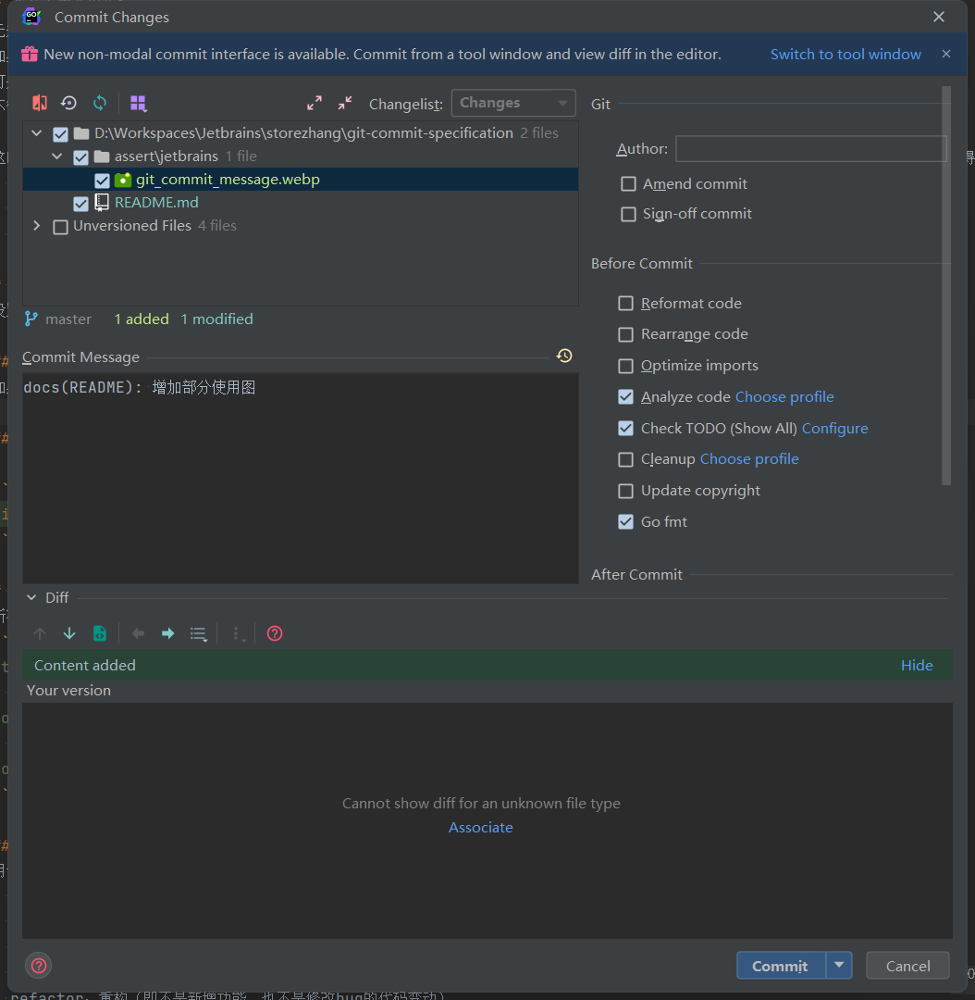
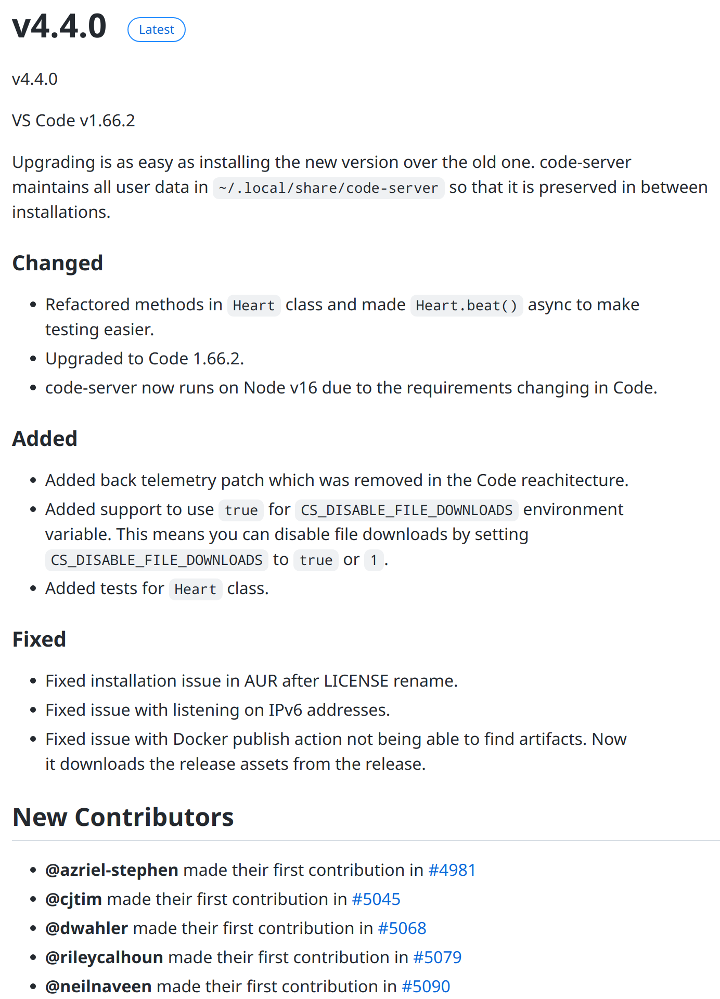
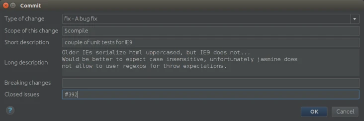

# 为什么需要规范？

无规矩不成方圆，编程也一样。
如果你有一个项目，从始至终都是自己写，那么你想怎么写都可以，没有人可以干预你。
可是如果在团队协作中，大家都张扬个性，那么代码将会是一团糟，好好的项目就被糟践了。
不管是开发还是日后维护，都将是灾难。

这时候，有人提出了何不统一标准，大家都按照这个标准来。`Git Commit`规范旨在规范每一次的代码提交信息，从这些规范的提交信息中，可以得到以下好处

- 规范的格式更有利于维护代码的提交记录
- 可以很方便的生成`Changelog`（每次发版可以很方便记录要发布的功能或者修复的Bug）
- 在`Feature`分支模型中，有利于将代码和任务关联起来（使用JIRA和Bitbucket）

# 如何设置提交消息

设置提交消息非常简单，可以是使用`IDE`和纯`Git命令`

## Jetbrains

如果是使用`IDE`请在IDE里面使用菜单设置


## Git命令

对于使用`Git命令`来说，一条简单的命令就可以完成提交信息的设置

```shell
git commit -m "feat(项目): 项目初始化"
```

> Git命令设置提交信息的方式在`CI/CD`中可能会用得更多一些，通常情况下，使用`IDE`即可

# 具体规则

所有的`Commit Message`必须满足如下格式

```
<type><scope>:<空格><subject>
<空行>
[optional body]
<空行>
[optional footer]
```

## type

用于说明提交的类别，只允许使用下面标识

- feat：新功能（feature）
- fix：修补（bug）
- docs：文档（documentation）
- style： 格式（不影响代码运行的变动）
- refactor：重构（即不是新增功能，也不是修改bug的代码变动）
- test：增加测试
- chore：构建过程或辅助工具的变动

## scope

用于说明影响的范围，这个范围可以是每个项目自己定义的范围，比如

- 数据层
- 控制层
- 视图层

可以不是上面这几种范围，只要在项目内大家认同即可。需要注意的是，如果使用的分支模型是`Feature`分支模型，那么会要求分支和任务编号关联起来，在这种情况下
`scope`将和任务编号一一对应，比如

```
feat(XXX-1234): 项目初始化
```

## subject

本次提交目的的简短描述，不超过50个字符，比如
> 1.以动词开头，使用第一人称现在时，比如change，而不是changed或changes
> 2.第一个字母小写
> 3.结尾不加句号（.）

## body（可选）

就是比较详细描述本次提交涉及的条目，罗列代码功能，这里可以使用`Markdown`的列表语法，也就是用中划线换行隔开条目。
当然`body`不是必选的，如果`subject`能够描述清楚的话

## foot（可选）

描述与本次提交相关联的`Break Change`或`Issue`

### Break Change

指明本次提交是否产生了破坏性修改，类似版本升级、接口参数减少、接口删除、迁移等。
如果产生了上述的影响强烈建议在提交信息中写明`Break Change`，有利于出问题时快速定位，回滚，复盘

### Issue

如果发现项目有Bug、或者有优化的建议、甚至新增一个任务，就可以利用`Issue`给项目提交一个任务。
`Issue`不是一些`Github`平台的专属功能，`JIRA`等平台也有类似功能，它们的作用大同小异，都可以很好地反应项目的成长状况和参与度。
那么在Git提交时，我们可以在`foot`区域关联本次提交涉及的`Issue`

# 不可提交的文件

`Git`工具本身并不限制你的提交内容，但是在开发中，有一些文件不能被提交的，包括但不限于

- 日志文件
- 项目编译可执行程序
- 相关的库文件（C++除外，因为至今没有依赖管理系统）
- 各种中间文件（go.sum）

以上文件严禁被提交到仓库中，此列表可能在后面有所增加

# Changelog

`Changelog`描述的是`变化`，而这个变化可以是任何文字，但是在如果能基于代码的提供日志来生成`Changelog`的话，那这个事情将变得有趣起来。
如果一个项目完成使用上述提交规范来提交的代码的话，那么生成`Changelog`将变得十分容易且美观


`Changelog`的生成方式有很多，都是基于提交日志，有很多方法可以生成`Changelog`，下面列出几种以供参考

## conventional-changelog

[conventional-changelog](https://github.com/conventional-changelog/conventional-changelog)可以很方便的生成`Changelog`
，基本命令

```shell
npm install -g commitizen
commitizen init cz-conventional-changelog --save-dev --save-exact
```

## git-chglog

`git-chglog`相对来说更使用方式更为灵活一点（功能性扩展性都要强一些），普通使用命令是

```shell
git-chglog 1.0.0..2.0.0
```

更详细的命令方法请参考[官方文档](https://github.com/git-chglog/git-chglog)

# 相关工具

说了这么多，相信你已经对Git提交的规范有所了解了。这里推荐一些有用的工具来帮助你将这些规范落实到位。
在`Intellij IDEA`的插件市场有很多`Git Commit Message`模板插件，可以可视化的实现这些规范

